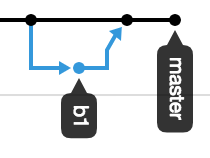

# Publish \(or update\)

Edits from gitbook can be published, or the code in github can be updated.

Edits on the gitbook are inserted directly into the master branch. Edits can be made in the file \(documentation/gitbook/untitled/publish-or-update.md\) on the master branch. Using

* `git add <filename>`
* `git commit -m <update message>`
* `git push`

To edit on a separate branch, use:

* `git checkout -b <name of new branch>` or `git checkout <name of branch>`
* Then the 3 steps above.
* Go to github to handle the pull request.
* Then move off the branch if desired.

